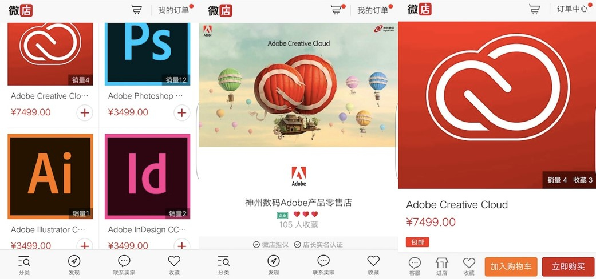
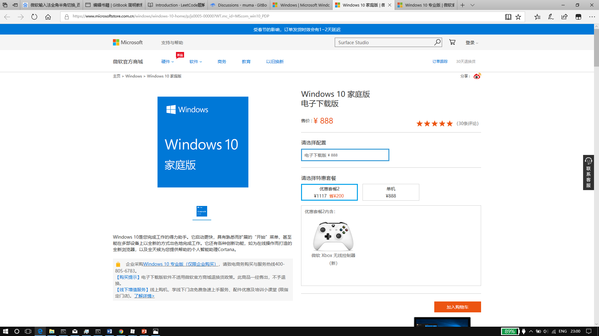

# 关于版权

这一章是首先要说的，如果小朋友们有留意的话，会发现身边版权相关的信息越来越多了，比如听音乐开始付费，在线看电影也开始付费。固然，这为荷包带来了负担，但是从长远来看，版权之路，势在必行。
如我们常用的PS，单独购买它的话，售价为￥3499，Adobe系列(如AE，AU，PR)一整套的售价为7499（每年），已经远远超出了很多小朋友的承受能力。

还有你们开机即可见到的Windows 10系统，家庭版售价￥888，专业版售价为￥1817。

软件付费的例子比比皆是，但是大部分小朋友并没有为此付出过相应的费用，其原因，一是使用了盗版，二是已经隐含在某些物品的价格里面了，比如Windows 10 系统的费用在你购买电脑的时候就已经包含在售价里面，国内的经销商很少有销售裸机（没有安装系统），在国外的网站上，裸机价格通常比安装了炒作系统的价格更低。

说那么多，倒不是逼着小朋友们去付费使用正版软件，对于我们来说，正版软件的价格目前是难以承受的，这倒不是说能光明正大，心安理得的使用盗版，而是在说在条件允许的情况下支持正版。也不用因为使用盗版而太过意不去，通常来说，正版软件的收入来自于企业用户，而非个人，对于微软、Adobe等公司来说，跟个人用户打官司的收益非常低，可能还不够律师费的，并且，盗版的使用某种程度上也为增加用户量攒下了基础，最明显例子的就是Windows系统、Office 套件、Adobe 套件，由于民间的大量使用，倒逼得企业采购相应的软件，间接增加了销售量。

So,你懂的(●ˇ∀ˇ●)