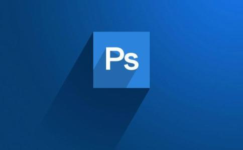

这一章节会开始Photoshop的内容。
Photoshop功能确实非常强大，但是我们只会用到一些非常基础的工具，这些工具的用法会很快就讲完。
对于海拔（其实就是一张图片），好看与否，取决于个人，自己满意就好。

## 碎话
Ps、Pr、Ae、Au都是Adobe公司开发的软件，Ps用于处理图像，Pr用于剪辑视频（适用于较长的视频）、Ae用于为视频增加特效（可以精确到帧），Au用于处理音频，能做这些事情的并不只有Adobe的软件，只是用Adobe的软件的人数相对来说多一些，其他的软件，用于图像处理的有著名的开源软件[GIMP](https://www.gimp.org/)，用于剪辑视频的有[Cinema 4d(c4d)](https://www.maxon.net/cn/)，都是非常优秀的软件。

软件只是实现想法的工具而已，并不用纠结于使用什么软件。重要的是想法，有想法，手画出来再拍下来也未尝不可(ง •_•)ง。