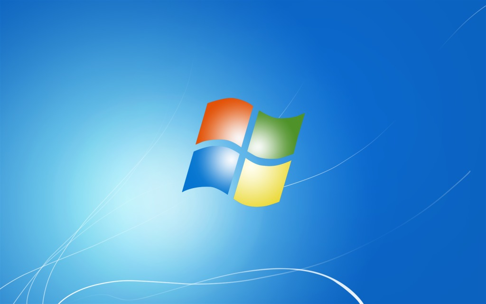
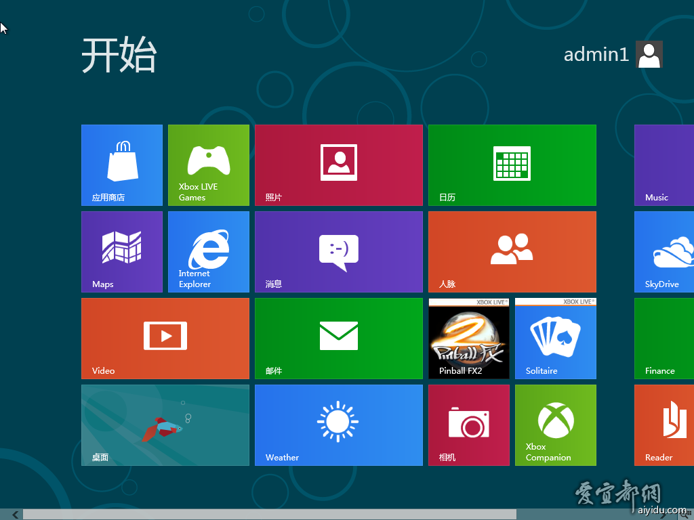
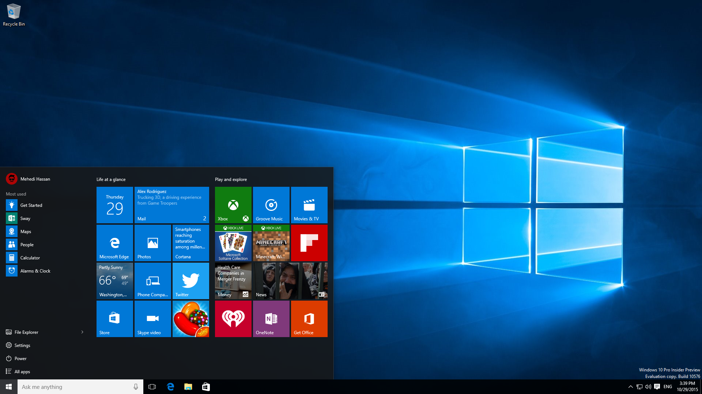

# 关于系统

## Windows

这里会简要的说说系统。目前，大部分你们见到的系统都是由美国微软公司开发的Windows系统，现在常见的版本有

<center>Windows 7</center>



<center>Windows 8/8.1</center>



<center>Windows 10</center>



这个小册子的大部分内容将会以Windows 10为基础，严格来说，是截至2018.02.17的Windows 10（Version 1709）。

之前有所提及，盗版的系统（严格来说是指网络上流传的雨木林风、冰峰等等第三方破解重制版本）会将某些系统的预防性内容阉割掉（比如系统还原点、家庭组等不常用的），甚至某些盗版系统还会被植入后门（Windows XP就有过这样的先例），安装某些软件的时候就会提示缺少某某dll，确实某些精简过的系统能在硬件较差的情况下比原版系统表现更好，但是这无疑冒了更大的风险。

微软的原版系统可以在[http://msdn.itellyou.cn/](http://msdn.itellyou.cn/)下载到，找到想要下载的文件，将右边信息里面的类似于这样的信息（下面的链接内是Windows 10 1709版本）复制到迅雷就可以下载了

```bash
ed2k://|file|cn_windows_10_multi-edition_version_1709_updated_sept_2017_x64_dvd_100090804.iso|4740610048|37051C54894776826823DAEBDD03F1DC|/
```

需要注意的是，某些文件带着`VL`，这个是大客户版，也就是面向企业的，一般情况下系统不选择这种版本，因为大部分电脑已经携带了正版 Windows 系统，安装与电脑上预装的版本相同的 Windows 可以自动激活。

## Linux

系统还是有很多的，还有一种系统与生活息息相关——[Linux](https://baike.baidu.com/item/linux/27050?fr=aladdin),较为常见的有路由器，路由器运行着一个mini版本的Linux系统，Linux也常见于各种服务器，数据中心，Linux有很多种版本，常见的有Ubuntu，Debian，Cent OS……，Linux的命令行操作远远超过Windows，同样，Linux也并不是面向普通用户的，使用它会给日常生活带来不少不便之处，比如，很多初触Linux的人会尝试安装QQ，但是实际上Linux版本的QQ很久很久以前就停止开发了（准确来说，之前有Linux版本的第三方QQ，但是被腾讯打压之后就GG了），通过某些方法确实可以安装上QQ，但是那是在Linux中虚拟出一个Windows环境，实际运行效率并不高。
另外，按照我的实际体验来看，Linux的电源管理比Windows差很多（我使用的是Ubuntu），也尝试过安装电源管理插件，但是效果甚微。
Linux的命令行操作某些时候确实很炫，所以不乏一些人用来装X，但是某些事情在Linux上做起来比在Windows上方便得多，比如安装软件，Linux只需要一条命令就可以安装需要的软件，而Windows大都需要自行下载安装包，另外Linux有着强大的开源社区支持，有很多优秀的小工具，短小精悍。
Linux常用于服务器并不是没有道理，Linux运行所需要的内存很小，路由器上的Linux仅需数十MB内存，臃肿的Ubuntu开机也仅仅会用去八百多MB。
在Linux做开发某些情况下会比在Windows上方便很多，首当其冲的是Linux大都不会遇到编码问题，然后是版本管理什么的，Linux也远没有Windows复杂。
需要注意的是，目前Linux的情况很混乱，尝试Linux得做好心理准备。

## Mac OS

Mac os(原OS X，后更名)是Apple公司为了其旗下笔记本Macbook系列开发的系统，与Linux一样是类Unix系统，有一定程度上的互通性，命令行操作很类似，也有着类似的权限管理机制。不过Apple做了一些限制，Mac OS只有在Macbook上才能运行良好，虽然网络上有大量的虚拟机或者在非Mac系列硬件上安装Mac OS的方法，但是实际运行状况都不如Mac系列的硬件，并不像Windows和Linux那样易于安装使用。

## 其他要说明的

小手册的大部分内容都会以Windows为例讲述，会对Linux有所涉及，Mac OS未使用过，留待以后的小朋友添砖加瓦。
啰嗦一下，会有人觉得修理店安装的系统用起来似乎更为流畅一些，对游戏的支持也更好，我先给答案————确实会有这种情况。修理店会安装某些精简过的系统，把系统运行的非必需的部分去掉了，比如Windows Search，这原本是Windows为了加快搜索速度而建立的一个服务，但是用得不多，所以某些精简系统中会把它禁用，甚至某些教你如何让电脑变快的教程中也会教人如何手动禁用它，如果对比到人，就像是扁桃体或者阑尾一样的存在，若仅仅是个精简的系统也还好，但是同样有可能是被安装了后门的系统，冒这个风险并不值得。(对于此，可以从百度一下ghosot，当初的xp后门风波)